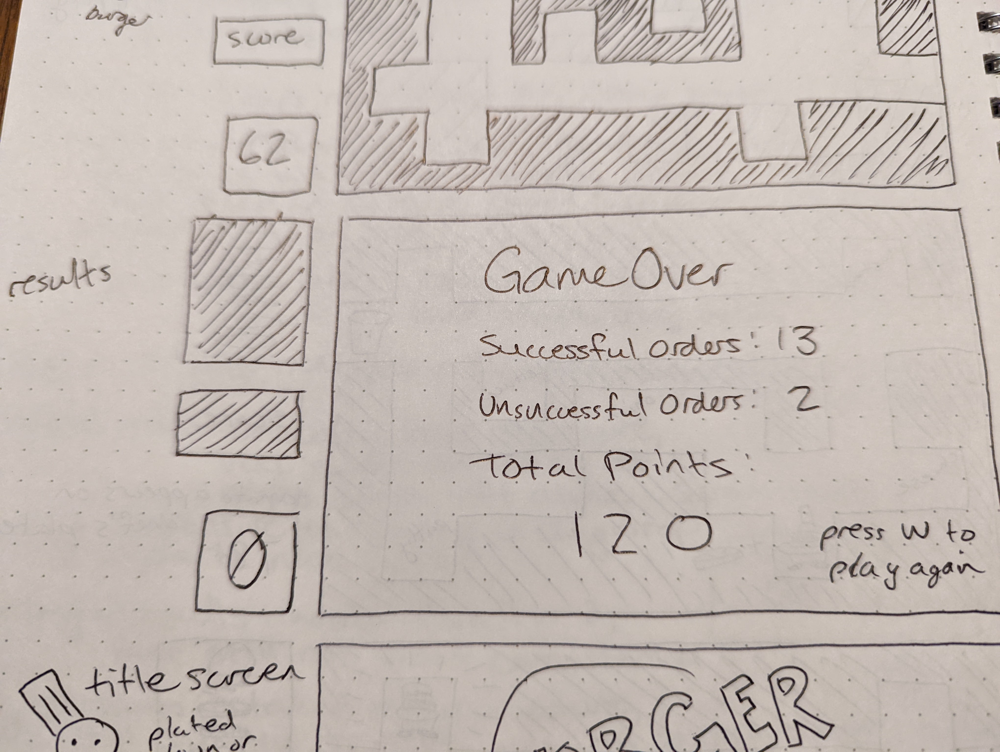

Project Burger

One-sentence pitch: Make as many burgers as you can against the ticking clock and score more and more points as you race to satisfy a series of extremely demanding customers.

Anticipated technologies: HTML, CSS, JavaScript, Canvas, Bootstrap

User Stories

The user should be able to:
1. Load the game and be presented with a start screen that includes instructions on how to play

2. Press a button to begin the game

3. Use WASD or the arrow keys to move a character up, down, left, or right on a grid system within a maze.

4. See a visual representation of the burger to be made.

5. Interact with ingredient stations around the arena that apply a specific ingredient to the burger.

6. See the added ingredients visually on their current order as it is built.

7. Interact with the service window to offload the finished burger.

8. Receive points for completing a successful order.

9. Receive a failure message and no points upon delivering a burger that does not have all ingredients.

10. See a timer that ticks down from a set time limit to 0.

11. Finish the game automatically once the timer hits 0.

12. Transition to a results screen where they are shown stats for:
    - successful orders
    - unsuccessful orders
    - their point total

13. Be able to press a button or click the screen to restart the game or return to title.

Feature List
1. Playable character that can move on a grid
2. Standard burger combo displayed in objective window
3. Areas with collision that cannot be passed through (maze)
4. Ingredient tiles that add an ingredient to the player's burger once per interaction
5. Pass/fail check upon delivering to service window
7. Point allocation for a finished burger, displayed on screen
8. Timer that ends the game when it reaches 0
9. Menu functionality for starting/restarting the game and displaying results

Current Anticipated Challenges:
1. Getting ingredient to add only once while inside an ingredient tile
2. How to check/compare player combo against objective
3. How do display ingredients visually on the canvas relative to the player and the burger stack
4. Getting images to load in canvas and apply collision

Stretch Goals:
1. A point multiplier for difficult or large combinations.
2. Garbage can to clear current plate if the player makes a mistake.
3. Persistent leaderboard using localStorage.
4. Different levels that have a chance to load each new game.
5. More polished game art.